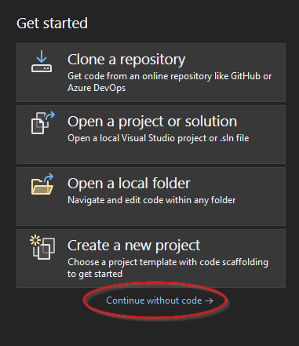

# VirtualBoard Extension for Visual Studio

Build and debug Arduino sketches with Visual C++ (MSVC) and Visual Studio 2022.

## Overview

Use the Visual Studio integrated development environment (IDE) to develop, build, run and debug your Arduino sketches as an executable directly at your Windows computer. Use network and serial connections of your computer directly from your Arduino sketch. Connect to I/O, SPI and I2C pins via [IO-Warrior](https://www.codemercs.com/en/io) hardware, connected via USB.

## Advantages

- Get a project template to obtain all required MSVC settings preconfigured for your sketch,
- Use the Arduino compatible VirtualBoard NuGet package, which provides the standard Arduino functions and libraries for your Windows sketch executable,
- Make up use of the super fast MSVC compiler and comprehensive Visual Studio debug features to speed up your sketch code development,
- Keep your sketch folder compatible with Arduino IDE or Arduino CLI and upload your sketches to real Arduino compatible boards,
- Add and use MSVC compatible Arduino libraries to your sketches or use special MSVC compatible library versions,
- Connect your running sketch simulation at your Windows computer with real I/O, SPI and I2C pins via [IO-Warrior](https://www.codemercs.com/en/io) hardware.

## Limitations

- MSVC, used by Visual Studio differs in some C++ language features from GCC compiler, used by the Arduino IDE,
- The Windows executable uses the 32bit features of your computer CPU which differs e.g. from the 8bit Arduino Uno,
- The Windows executable also uses huge memory resources of your computer, compared to the 2K RAM size of an Arduino Uno,
- Windows is not a real time OS, so no interrupts or time critical response time is supported.

## Getting Started

### Prerequisites

To create VirtualBoard applications for your Arduino sketches you will need [Visual Studio 2022](https://visualstudio.microsoft.com/vs/) with workload "Desktop development with C++" installed.  

### Install Visual Studio extension
1. Launch Visual Studio 2022, then click `Continue without code`. 
   
   
2. Click `Extensions -> Manage Extensions` from the Menu Bar.
   
   
3. In the Extension Manager expand the **Online** node and search for `Arduino`, install the `VirtualBoardExtension` or download it from the [Visual Studio Marketplace](https://marketplace.visualstudio.com/items?itemName=virtual-maker.virtualboardextension).
   
   
4. Close Visual Studio to actual start the installation of the extension. Then restart Visual Studio again.

### Create an Arduino sketch application from template
...

## Videos

- Install VS2022 Community Edition and the VirtualBoard extension
- Use the Arduino project template to create a new or already existing Arduino sketch
- Debug a VirtualBoard sketch with VS2022
- Add additional Arduino libraries
- Connect to real I/O, SPI and I2C pins via IO-Warrior hardware